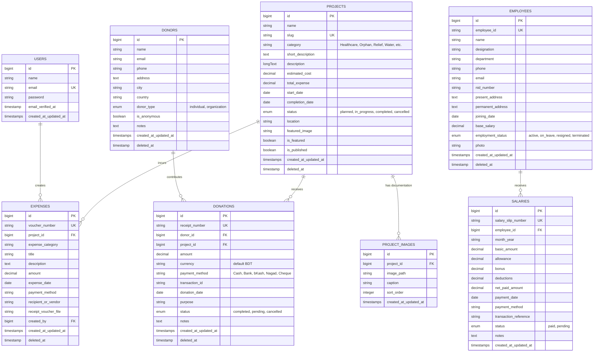

# Shanti Nagar Foundation — Database Schema & Architecture

## Overview
This document serves as the single source of truth for the database design and relational architecture of the **Shanti Nagar Foundation / Santi Nagar Association** web application.

---

## Entity Relationship Diagram (ERD)

---

## Detailed Table Schemas

### 1. `users`
* Authentication and administrative staff access.
* **Fields:** `id`, `name`, `email` (unique), `password`, `email_verified_at`, `remember_token`, `created_at`, `updated_at`.

### 2. `donors`
* Stores registered or anonymous donors (individuals and institutional trusts).
* **Fields:** `id`, `name`, `email` (index), `phone` (index), `address`, `city`, `country`, `donor_type` (`individual`, `organization`), `is_anonymous` (bool), `notes`, `created_at`, `updated_at`, `deleted_at`.
* **Relations:** `hasMany(Donation::class)`.

### 3. `projects`
* Manages social welfare campaigns, community initiatives, and emergency relief drives.
* **Fields:** `id`, `name`, `slug` (unique), `category`, `short_description`, `description`, `estimated_cost`, `total_expense`, `start_date`, `completion_date`, `status` (`planned`, `in_progress`, `completed`, `cancelled`), `location`, `featured_image`, `is_featured`, `is_published`, `created_at`, `updated_at`, `deleted_at`.
* **Relations:** `hasMany(Donation::class)`, `hasMany(Expense::class)`, `hasMany(ProjectImage::class)`.

### 4. `project_images`
* High-resolution field photos and completion documentation linked to projects.
* **Fields:** `id`, `project_id` (foreign key -> `projects.id`), `image_path`, `caption`, `sort_order`, `created_at`, `updated_at`.
* **Relations:** `belongsTo(Project::class)`.

### 5. `donations`
* Complete audit trail of donor contributions.
* **Fields:** `id`, `receipt_number` (unique), `donor_id` (foreign key -> `donors.id`), `project_id` (foreign key -> `projects.id`), `amount`, `currency` (BDT), `payment_method`, `transaction_id`, `donation_date`, `purpose`, `status` (`completed`, `pending`, `cancelled`), `notes`, `created_at`, `updated_at`, `deleted_at`.
* **Relations:** `belongsTo(Donor::class)`, `belongsTo(Project::class)`.

### 6. `expenses`
* Operational and project procurement expenditures with voucher numbers.
* **Fields:** `id`, `voucher_number` (unique), `project_id` (foreign key -> `projects.id`, nullable for admin expenses), `expense_category`, `title`, `description`, `amount`, `expense_date`, `payment_method`, `recipient_or_vendor`, `receipt_voucher_file`, `created_by` (foreign key -> `users.id`), `created_at`, `updated_at`, `deleted_at`.
* **Relations:** `belongsTo(Project::class)`, `belongsTo(User::class, 'created_by')`.

### 7. `employees`
* Foundation operational staff, coordinators, and caregivers.
* **Fields:** `id`, `employee_id` (unique), `name`, `designation`, `department`, `phone`, `email`, `nid_number`, `present_address`, `permanent_address`, `joining_date`, `base_salary`, `employment_status`, `photo`, `created_at`, `updated_at`, `deleted_at`.
* **Relations:** `hasMany(Salary::class)`.

### 8. `salaries`
* Monthly disbursement vouchers and compensation payment history.
* **Fields:** `id`, `salary_slip_number` (unique), `employee_id` (foreign key -> `employees.id`), `month_year`, `basic_amount`, `allowance`, `bonus`, `deductions`, `net_paid_amount`, `payment_date`, `payment_method`, `transaction_reference`, `status` (`paid`, `pending`), `notes`, `created_at`, `updated_at`.
* **Relations:** `belongsTo(Employee::class)`.

---

## 3. Eloquent Model Relationships Code Reference

| Model Class | Method | Relationship Type | Target Model | Foreign Key | Inverse / Pair |
| :--- | :--- | :--- | :--- | :--- | :--- |
| **`User`** | `expenses()` | `hasMany` | `Expense` | `created_by` | `Expense::belongsTo(User, 'created_by')` |
| **`Donor`** | `donations()` | `hasMany` | `Donation` | `donor_id` | `Donation::belongsTo(Donor)` |
| **`Project`** | `donations()` | `hasMany` | `Donation` | `project_id` | `Donation::belongsTo(Project)` |
| **`Project`** | `expenses()` | `hasMany` | `Expense` | `project_id` | `Expense::belongsTo(Project)` |
| **`Project`** | `images()` | `hasMany` | `ProjectImage`| `project_id` | `ProjectImage::belongsTo(Project)` |
| **`ProjectImage`**| `project()`| `belongsTo`| `Project` | `project_id` | `Project::hasMany(ProjectImage)` |
| **`Donation`** | `donor()` | `belongsTo` | `Donor` | `donor_id` | `Donor::hasMany(Donation)` |
| **`Donation`** | `project()` | `belongsTo` | `Project` | `project_id` | `Project::hasMany(Donation)` |
| **`Expense`** | `project()` | `belongsTo` | `Project` | `project_id` | `Project::hasMany(Expense)` |
| **`Expense`** | `creator()` | `belongsTo` | `User` | `created_by` | `User::hasMany(Expense, 'created_by')` |
| **`Employee`** | `salaries()` | `hasMany` | `Salary` | `employee_id` | `Salary::belongsTo(Employee)` |
| **`Salary`** | `employee()` | `belongsTo` | `Employee` | `employee_id` | `Employee::hasMany(Salary)` |

### Helper & Calculation Accessors in Models
* `Project::getTotalDonationsRaisedAttribute()`: Returns total amount from completed donations.
* `Project::getActualExpenseTotalAttribute()`: Returns total expenses spent on the project.
* `Project::getRemainingBudgetAttribute()`: `estimated_cost - total_expense`.
* `Employee::getCurrentMonthSalaryStatusAttribute()`: Check if current month salary is paid.

