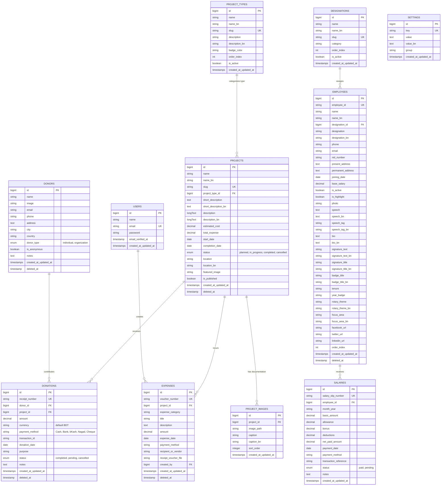

# Rotary Club of Shantinagar Dhaka — Database Schema & Architecture

## Overview
This document serves as the single source of truth for the database design and relational architecture of the **Rotary Club of Shantinagar Dhaka** web application.

---

## Entity Relationship Diagram (ERD)

```mermaid
erDiagram
    PROJECT_TYPES ||--o{ PROJECTS : "categorizes type"
    USERS ||--o{ EXPENSES : "creates"
    DONORS ||--o{ DONATIONS : "contributes"
    PROJECTS ||--o{ DONATIONS : "receives"
    PROJECTS ||--o{ EXPENSES : "incurs"
    PROJECTS ||--o{ PROJECT_IMAGES : "has documentation"
    DESIGNATIONS ||--o{ EMPLOYEES : "assigns"
    EMPLOYEES ||--o{ SALARIES : "receives"

    PROJECT_TYPES {
        bigint id PK
        string name
        string name_bn
        string slug UK
        string description
        string description_bn
        string badge_color
        int order_index
        boolean is_active
        timestamps created_at_updated_at
    }

    DESIGNATIONS {
        bigint id PK
        string name
        string name_bn
        string slug UK
        string category
        int order_index
        boolean is_active
        timestamps created_at_updated_at
    }

    USERS {
        bigint id PK
        string name
        string email UK
        string password
        timestamp email_verified_at
        timestamps created_at_updated_at
    }

    DONORS {
        bigint id PK
        string name
        string image
        string email
        string phone
        text address
        string city
        string country
        enum donor_type "individual, organization"
        boolean is_anonymous
        text notes
        timestamps created_at_updated_at
        timestamp deleted_at
    }

    PROJECTS {
        bigint id PK
        string name
        string name_bn
        string slug UK
        bigint project_type_id FK
        text short_description
        text short_description_bn
        longText description
        longText description_bn
        decimal estimated_cost
        decimal total_expense
        date start_date
        date completion_date
        enum status "planned, in_progress, completed, cancelled"
        string location
        string location_bn
        string featured_image
        boolean is_published
        timestamps created_at_updated_at
        timestamp deleted_at
    }

    PROJECT_IMAGES {
        bigint id PK
        bigint project_id FK
        string image_path
        string caption
        string caption_bn
        integer sort_order
        timestamps created_at_updated_at
    }

    DONATIONS {
        bigint id PK
        string receipt_number UK
        bigint donor_id FK
        bigint project_id FK
        decimal amount
        string currency "default BDT"
        string payment_method "Cash, Bank, bKash, Nagad, Cheque"
        string transaction_id
        date donation_date
        string purpose
        enum status "completed, pending, cancelled"
        text notes
        timestamps created_at_updated_at
        timestamp deleted_at
    }

    EXPENSES {
        bigint id PK
        string voucher_number UK
        bigint project_id FK
        string expense_category
        string title
        text description
        decimal amount
        date expense_date
        string payment_method
        string recipient_or_vendor
        string receipt_voucher_file
        bigint created_by FK
        timestamps created_at_updated_at
        timestamp deleted_at
    }

    EMPLOYEES {
        bigint id PK
        string employee_id UK
        string name
        string name_bn
        bigint designation_id FK
        string designation
        string designation_bn
        string phone
        string email
        string nid_number
        text present_address
        text permanent_address
        date joining_date
        decimal base_salary
        boolean is_active
        boolean is_highlight
        string photo
        text speech
        text speech_bn
        string speech_tag
        string speech_tag_bn
        text bio
        text bio_bn
        string signature_text
        string signature_text_bn
        string signature_title
        string signature_title_bn
        string badge_title
        string badge_title_bn
        string tenure
        string year_badge
        string rotary_theme
        string rotary_theme_bn
        string focus_area
        string focus_area_bn
        string facebook_url
        string twitter_url
        string linkedin_url
        int order_index
        timestamps created_at_updated_at
        timestamp deleted_at
    }

    SALARIES {
        bigint id PK
        string salary_slip_number UK
        bigint employee_id FK
        string month_year
        decimal basic_amount
        decimal allowance
        decimal bonus
        decimal deductions
        decimal net_paid_amount
        date payment_date
        string payment_method
        string transaction_reference
        enum status "paid, pending"
        text notes
        timestamps created_at_updated_at
    }

    SETTINGS {
        bigint id PK
        string key UK
        text value
        text value_bn
        string group
        timestamps created_at_updated_at
    }
```

---

## Detailed Table Schemas

### 1. `project_types`
* Dynamic classification for projects (Continuous Project, Monthly Project, Signature Project, General Campaign).
* **Fields:** `id`, `name`, `name_bn`, `slug` (unique), `description`, `description_bn`, `badge_color`, `order_index`, `is_active` (boolean), `created_at`, `updated_at`.
* **Relations:** `hasMany(Project::class)`.

### 2. `users`
* Authentication and administrative staff access.
* **Fields:** `id`, `name`, `email` (unique), `password`, `email_verified_at`, `remember_token`, `created_at`, `updated_at`.

### 3. `donors`
* Stores registered or anonymous donors (individuals and institutional trusts).
* **Fields:** `id`, `name`, `image` (avatar / logo), `email` (index), `phone` (index), `address`, `city`, `country`, `donor_type` (`individual`, `organization`), `is_anonymous` (bool), `notes`, `created_at`, `updated_at`, `deleted_at`.
* **Relations:** `hasMany(Donation::class)`.

### 4. `projects`
* Manages social welfare campaigns, community initiatives, and emergency relief drives.
* **Fields:** `id`, `name`, `name_bn`, `slug` (unique), `project_type_id` (foreign key -> `project_types.id`, nullable), `short_description`, `short_description_bn`, `description`, `description_bn`, `estimated_cost`, `total_expense`, `start_date`, `completion_date`, `status` (`planned`, `in_progress`, `completed`, `cancelled`), `location`, `location_bn`, `featured_image`, `is_published`, `created_at`, `updated_at`, `deleted_at`.
* **Relations:** `belongsTo(ProjectType::class)`, `hasMany(Donation::class)`, `hasMany(Expense::class)`, `hasMany(ProjectImage::class)`.

### 5. `project_images`
* High-resolution field photos and completion documentation linked to projects.
* **Fields:** `id`, `project_id` (foreign key -> `projects.id`), `image_path`, `caption`, `caption_bn`, `sort_order`, `created_at`, `updated_at`.
* **Relations:** `belongsTo(Project::class)`.

### 6. `donations`
* Complete audit trail of donor contributions.
* **Fields:** `id`, `receipt_number` (unique), `donor_id` (foreign key -> `donors.id`), `project_id` (foreign key -> `projects.id`), `amount`, `currency` (BDT), `payment_method`, `transaction_id`, `donation_date`, `purpose`, `status` (`completed`, `pending`, `cancelled`), `notes`, `created_at`, `updated_at`, `deleted_at`.
* **Relations:** `belongsTo(Donor::class)`, `belongsTo(Project::class)`.

### 7. `expenses`
* Operational and project procurement expenditures with voucher numbers.
* **Fields:** `id`, `voucher_number` (unique), `project_id` (foreign key -> `projects.id`, nullable for admin expenses), `expense_category`, `title`, `description`, `amount`, `expense_date`, `payment_method`, `recipient_or_vendor`, `receipt_voucher_file`, `created_by` (foreign key -> `users.id`), `created_at`, `updated_at`, `deleted_at`.
* **Relations:** `belongsTo(Project::class)`, `belongsTo(User::class, 'created_by')`.

### 8. `designations`
* Dynamic organizational leadership and staff designations.
* **Fields:** `id`, `name`, `name_bn`, `slug` (unique), `category` (nullable), `order_index` (integer), `is_active` (boolean), `created_at`, `updated_at`.
* **Relations:** `hasMany(Employee::class)`.

### 9. `employees`
* Foundation operational staff, executive leadership members, governing body directors, and coordinators.
* **Fields:** `id`, `employee_id` (unique), `name`, `name_bn`, `designation_id` (foreign key -> `designations.id`, nullable), `designation`, `designation_bn`, `phone`, `email`, `nid_number`, `present_address`, `permanent_address`, `joining_date`, `base_salary`, `is_active` (boolean), `is_highlight` (boolean), `photo`, `speech`, `speech_bn`, `speech_tag`, `speech_tag_bn`, `bio`, `bio_bn`, `signature_text`, `signature_text_bn`, `signature_title`, `signature_title_bn`, `badge_title`, `badge_title_bn`, `facebook_url`, `twitter_url`, `linkedin_url`, `order_index`, `created_at`, `updated_at`, `deleted_at`.
* **Relations:** `belongsTo(Designation::class)`, `hasMany(Salary::class)`.

### 10. `salaries`
* Monthly disbursement vouchers and compensation payment history.
* **Fields:** `id`, `salary_slip_number` (unique), `employee_id` (foreign key -> `employees.id`), `month_year`, `basic_amount`, `allowance`, `bonus`, `deductions`, `net_paid_amount`, `payment_date`, `payment_method`, `transaction_reference`, `status` (`paid`, `pending`), `notes`, `created_at`, `updated_at`.
* **Relations:** `belongsTo(Employee::class)`.

### 11. `contact_messages`
* Public visitor and donor contact inquiries submitted from the website and floating quick-help drawer.
* **Fields:** `id`, `name`, `email` (nullable), `phone` (nullable), `subject` (nullable), `message`, `status` (`unread`, `read`, `replied`), `admin_reply`, `replied_at`, `created_at`, `updated_at`, `deleted_at`.

### 12. `volunteers`
* Community volunteer registrations and field helper applications.
* **Fields:** `id`, `name`, `email`, `phone`, `gender`, `age_group`, `address`, `status` (`pending`, `approved`, `rejected`), `notes`, `notes_bn`, `created_at`, `updated_at`, `deleted_at`.

### 13. `settings`
* Dynamic key-value pairs for organization settings, phone, emails, emergency helplines, social URLs, and bank details.
* **Fields:** `id`, `key` (unique), `value`, `value_bn`, `group`, `created_at`, `updated_at`.

### 14. `albums`
* Activity, campaign, and event photo albums for the Rotary Club.
* **Fields:** `id`, `title`, `title_bn`, `slug` (unique), `description`, `description_bn`, `cover_image`, `event_date`, `is_active`, `sort_order`, `created_at`, `updated_at`.

### 15. `gallery_images`
* Gallery photographs categorized under albums or standalone general field moments.
* **Fields:** `id`, `album_id` (nullable FK -> `albums.id`), `title`, `title_bn`, `caption`, `caption_bn`, `image_path`, `is_featured`, `is_active`, `sort_order`, `created_at`, `updated_at`.

### 16. `activities`
* Rotary Club field initiatives, community drives, medical camps, seminars, and distribution campaigns.
* **Fields:** `id`, `title`, `title_bn`, `slug` (unique, auto-generated from title), `event_date`, `event_time`, `location`, `location_bn`, `short_description`, `short_description_bn`, `description`, `description_bn`, `featured_image`, `status` (`upcoming`, `ongoing`, `completed`, `cancelled`), `is_featured`, `is_published`, `sort_order`, `created_at`, `updated_at`, `deleted_at`.

---

## 3. Eloquent Model Relationships Code Reference

| Model Class | Method | Relationship Type | Target Model | Foreign Key | Inverse / Pair |
| :--- | :--- | :--- | :--- | :--- | :--- |
| **`ProjectType`** | `projects()` | `hasMany` | `Project` | `project_type_id` | `Project::belongsTo(ProjectType)` |
| **`Project`** | `projectType()` | `belongsTo` | `ProjectType` | `project_type_id` | `ProjectType::hasMany(Project)` |
| **`User`** | `expenses()` | `hasMany` | `Expense` | `created_by` | `Expense::belongsTo(User, 'created_by')` |
| **`Donor`** | `donations()` | `hasMany` | `Donation` | `donor_id` | `Donation::belongsTo(Donor)` |
| **`Project`** | `donations()` | `hasMany` | `Donation` | `project_id` | `Donation::belongsTo(Project)` |
| **`Project`** | `expenses()` | `hasMany` | `Expense` | `project_id` | `Expense::belongsTo(Project)` |
| **`Project`** | `images()` | `hasMany` | `ProjectImage`| `project_id` | `ProjectImage::belongsTo(Project)` |
| **`ProjectImage`**| `project()`| `belongsTo`| `Project` | `project_id` | `Project::hasMany(ProjectImage)` |
| **`Donation`** | `donor()` | `belongsTo` | `Donor` | `donor_id` | `Donor::hasMany(Donation)` |
| **`Donation`** | `project()` | `belongsTo` | `Project` | `project_id` | `Project::hasMany(Donation)` |
| **`Expense`** | `project()` | `belongsTo` | `Project` | `project_id` | `Project::hasMany(Expense)` |
| **`Expense`** | `creator()` | `belongsTo` | `User` | `created_by` | `User::hasMany(Expense, 'created_by')` |
| **`Designation`** | `employees()` | `hasMany` | `Employee` | `designation_id` | `Employee::belongsTo(Designation)` |
| **`Employee`** | `designation()` | `belongsTo` | `Designation` | `designation_id` | `Designation::hasMany(Employee)` |
| **`Employee`** | `salaries()` | `hasMany` | `Salary` | `employee_id` | `Salary::belongsTo(Employee)` |
| **`Salary`** | `employee()` | `belongsTo` | `Employee` | `employee_id` | `Employee::hasMany(Salary)` |
| **`Album`** | `images()` | `hasMany` | `GalleryImage` | `album_id` | `GalleryImage::belongsTo(Album)` |
| **`GalleryImage`**| `album()` | `belongsTo` | `Album` | `album_id` | `Album::hasMany(GalleryImage)` |

### Helper & Calculation Accessors in Models
* `Project::getTotalDonationsRaisedAttribute()`: Returns total amount from completed donations.
* `Project::getActualExpenseTotalAttribute()`: Returns total expenses spent on the project.
* `Project::getRemainingBudgetAttribute()`: `estimated_cost - total_expense`.
* `Project::getLocalizedNameAttribute()`: Returns `name_bn` if locale is Bengali, falls back to `name`.
* `Project::getLocalizedShortDescriptionAttribute()`: Returns `short_description_bn` or falls back to English.
* `Project::getLocalizedDescriptionAttribute()`: Returns `description_bn` or falls back to English.
* `Project::getLocalizedLocationAttribute()`: Returns `location_bn` or falls back to English.
* `Activity::getLocalizedTitleAttribute()`: Returns `title_bn` or falls back to `title`.
* `Activity::getLocalizedShortDescriptionAttribute()`: Returns `short_description_bn` or falls back to English.
* `Activity::getLocalizedDescriptionAttribute()`: Returns `description_bn` or falls back to English.
* `Activity::getLocalizedLocationAttribute()`: Returns `location_bn` or falls back to English.
* `Activity::getFeaturedImageUrlAttribute()`: Resolves featured image URL.
* `ProjectType::getLocalizedNameAttribute()`: Returns `name_bn` or falls back to English.
* `ProjectType::getLocalizedDescriptionAttribute()`: Returns `description_bn` or falls back to English.
* `Employee::getLocalizedNameAttribute()`: Returns `name_bn` or falls back to English.
* `Employee::getLocalizedBioAttribute()`: Returns `bio_bn` or falls back to English.
* `Employee::getLocalizedSpeechAttribute()`: Returns `speech_bn` or falls back to English.
* `Employee::getLocalizedSpeechTagAttribute()`: Returns `speech_tag_bn` or falls back to English.
* `Employee::getLocalizedSignatureTextAttribute()`: Returns `signature_text_bn` or falls back to English.
* `Employee::getLocalizedSignatureTitleAttribute()`: Returns `signature_title_bn` or falls back to English.
* `Employee::getLocalizedBadgeTitleAttribute()`: Returns `badge_title_bn` or falls back to English.
* `Employee::getCurrentMonthSalaryStatusAttribute()`: Check if current month salary is paid.
* `ProjectImage::getLocalizedCaptionAttribute()`: Returns `caption_bn` or falls back to English.
* `Album::getLocalizedTitleAttribute()`: Returns `title_bn` or falls back to English.
* `Album::getLocalizedDescriptionAttribute()`: Returns `description_bn` or falls back to English.
* `Album::getCoverImageUrlAttribute()`: Resolves cover image URL or fallbacks.
* `GalleryImage::getLocalizedTitleAttribute()`: Returns `title_bn` or falls back to English.
* `GalleryImage::getLocalizedCaptionAttribute()`: Returns `caption_bn` or falls back to English.
* `GalleryImage::getImageUrlAttribute()`: Resolves image path into asset URL.

